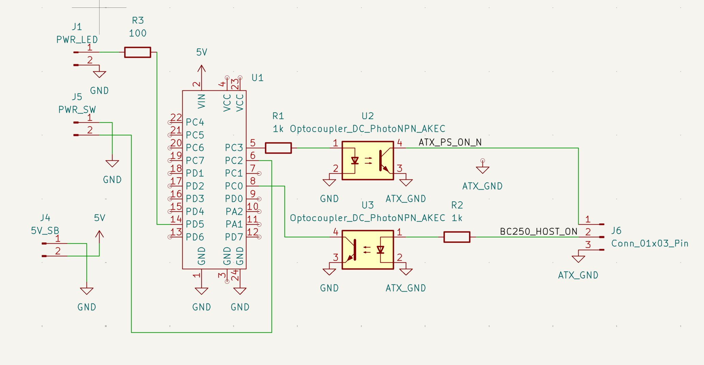

# Circuit Description



## PS_ON Control (PC3 → ATX PS_ON)

```
PC3 ──[R1 1kΩ]──→ U2 LED+
                   U2 LED- ──→ GND

U2 Collector ──→ ATX PS_ON (pin 16)
U2 Emitter   ──→ ATX GND   (pin 15)
```

PC3 HIGH → U2 on → ATX PS_ON pulled to GND → PSU starts.

---
## HOST_ON Sense (BC250 CPU_FAN Pin 2 → PC0 / HOST_ON_IN)

```
HOST_ON (CPU_FAN Pin 2, 12 V) ──[R2 1kΩ]──→ U3 LED+
```
                               U3 LED- ──→ GND

PC0 (internal pull-up) ──→ U3 Collector ──→ PC0 (HOST_ON_IN)
                            U3 Emitter   ──→ GND
```

BC250 ON (12 V) → U3 on → PC0 pulled LOW.  
BC250 OFF (0 V) → U3 off → internal pull-up → PC0 HIGH.

---

## Power Button Input (PC6 / BTN_IN)

```
PC6 (internal pull-up) ──┬── SW1 ──→ GND
```

Button pressed → PC6 LOW (active-low).

---

## Power LED (PC7 / PWR_LED_OUT_P)

```
PC7 ──[R3 100Ω]──[J1]──→ LED+ (PWR_LED_OUT_P)
                           LED- ──→ GND (PWR_LED_OUT_N)
```

R3 limits current to ~15 mA for standard backlit buttons.  
Short solder jumper J1 to bypass R3 for high-current loads (max 250 mA).
Note: Some schematic versions may show this on PC4, but PC7 is the designated pin for the external status LED.
